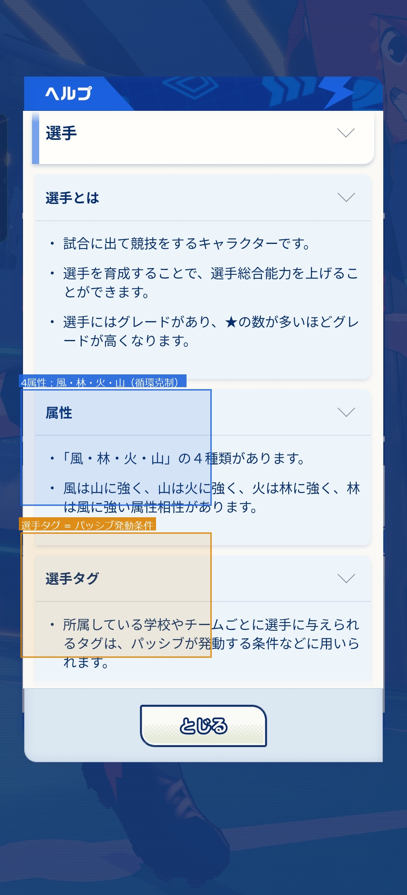
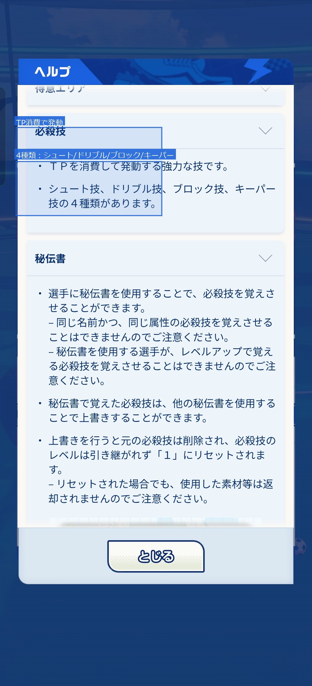
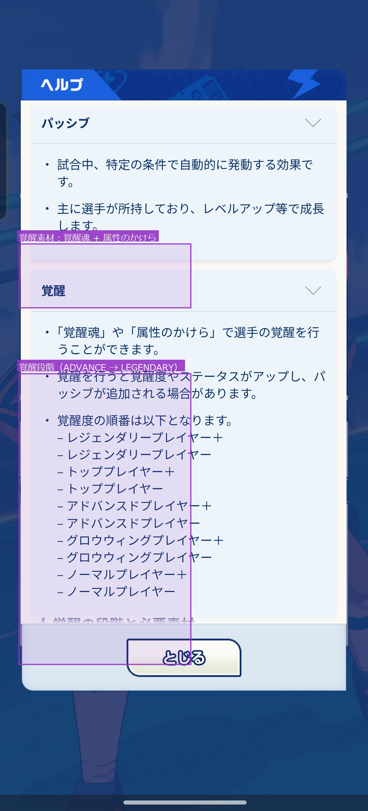
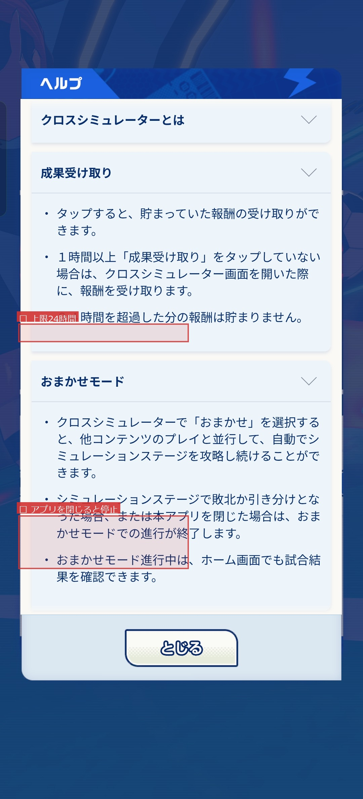
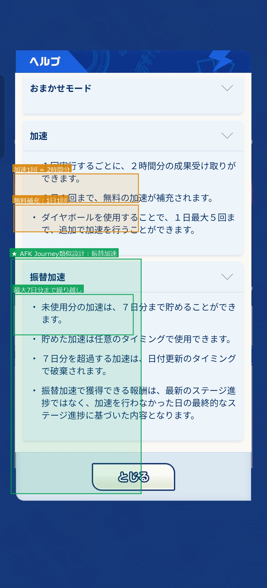

# イナズマイレブン クロス 新作调研报告

**调查时间：** 2026年6月  
**主要数据源：** game8.jp/inazuma-cross（攻略站），appmedia.jp/inazuma-cross，官方游戏系统  
**市场参照：** 放置系手游市场趋势（以 AFK: Journey 为代表）  
**注：** AFK: Journey 作为市场背景参照使用，非直接竞品。Twitter/X、Reddit 受访问限制，玩家评价部分基于 Google Play 公开评价及可访问的社区内容。

---

## 一、专有名词与对应机能

| 专有名词 | 读法 | 对应机能说明 | AFK: Journey 对应 |
|---|---|---|---|
| **TP**（テクニカルポイント） | Technical Point | 对战中使用必殺技消耗的资源；命令战胜利时积累，失败时减少；每个技能有固定TP消耗值 | Mana / Energy |
| **必殺技**（ひっさつわざ） | 必杀技 | 4种类型：シュート（射门）/ ドリブル（运球）/ ブロック（拦截）/ キーパー（扑救）；附带属性、TP、射程、暴击率参数 | 技能/Ultimate |
| **属性**（4すくみ） | 风·林·火·山 | 四属性循环克制：风克山、山克火、火克林、林克风；克属性时必殺技威力有加成 | 元素/装甲克制 |
| **ポジション** | FW/MF/DF/GK | 前锋/中场/后卫/门将，决定场上职责与推荐技能类型 | 职业/Role |
| **覚醒**（かくせい） | 觉醒 | 角色进阶：ADVANCE → ADVANCE+ → TOP → TOP+ → LEGENDARY；提升基础数值并解锁/强化被动技能；需消耗「覚醒魂」和属性碎片 | 超越/Ascension |
| **覚醒魂**（かくせいたましい） | 觉醒魂 | 觉醒材料；来源：抽卡重复角色、活动商店、人脈ボード | 英雄碎片/Soulstone |
| **人脈ボード** | 人脉版 | 网格式进度解锁系统，完成后可获得角色、道具、解锁节点；参与对战与信頼度系统推进 | 英雄感情板/Bond Board |
| **信頼度**（しんらいど） | 信任度 | 出阵后自动积累；达到里程碑奖励ダイヤボール（高级货币）；解锁人脈ボード节点 | 好感度/Friendship |
| **クロスシミュレーター** | 体能训练器 | 挂机自动收益系统；支持「ハイライトモード」倍速；产出角色培育材料（サプリ） | AFK报酬/Idle Chest |
| **サプリ** | 补给品 | 达到关键等级（每10级）时消耗的特殊材料，解锁被动技能成长；仅来源于クロスシミュレーター | 进阶石材 |
| **秘伝書**（ひでんしょ） | 秘传书 | 将技能"教给"不具备该技能的角色；リミテッドバトル等需使用以填补战术空缺 | 技能书/Skill Tome |
| **ダイヤボール** | 钻石球 | 高级抽卡货币；由信頼度奖励、任务、活动获取 | 钻石/Diamond |
| **熱血ポイント** | 热血值 | PvP（対戦）奖励货币，随段位提升获取量增加 | 竞技币/Arena Coin |
| **コアメンバー** | 核心成员 | 队伍中5名主要角色，等级最低者决定全队上限；强制均衡培养设计 | 共鸣等级限制 |
| **シュートチェイン** | 连射 | 部分射门技能的特性；允许多角色连续射门叠加；标注「可/不可」 | 连击/Chain |
| **フォーメーション** | 阵型 | 影响场上站位与战术方向；リミテッドバトルでは二种まで限定 | 阵型/Formation |
| **対戦** | PvP | 排名赛制：NORMAL → GROWING → ADVANCED → TOP → LEGENDARY → HERO；每日免费5次；奖励按日/周/赛季三级结算 | 竞技场/Arena |

### 游戏系统截图参照

| 图① 選手・属性・タグ | 图② 必殺技・TP | 图③ パッシブ・覚醒 |
|:---:|:---:|:---:|
|  |  |  |
| 蓝框：4属性循環克制（風林火山） 橙框：タグ=パッシブ条件 | 蓝框：TP消費・4種類 | 紫框：覚醒素材・段位リスト |

---

## 二、活动玩法规则（3个案例）

### 活动①：サービス開始記念イベント（服务开始纪念活动）
**期间：** 2026/6/9 ～ 7/9  
**来源：** game8.jp/inazuma-cross/788218

**核心机制：**
- 进行活动专用关卡获取「活动代币」
- 代币在限时商店兑换奖励（最高优先级：タペストリー2000枚、秘伝書1500枚）
- 配套一张「個人人脈ボード」（专属关系版），完成全节点可**确定获得角色「栗松鉄平」并完成全觉醒**，无需抽卡

**设计特点：**  
确定奖励角色通过"版面完成"而非概率抽卡获取——降低了零氪玩家的获取门槛，但需持续刷活动关卡推进进度。结构与AFK: Journey的"限时剧情活动+奖励兑换"高度类似，差异在于角色获取方式更具确定性。

---

### 活动②：リミテッドサッカーバトル（限定足球对战）
**来源：** game8.jp/inazuma-cross/789626

**核心机制：**
- 编队受限：只能使用特定派系角色（雷门、帝国、日本代表等）；同派系至少需拥有5名角色才可挑战
- 阵型限制：可用阵型仅剩2种（普通游戏无此限制）
- 战术难度：中央通道适性成为关键评估指标；边路型角色使用受限
- GK空缺补救：若派系内无合适门将，可使用「秘伝書」跨职业学习守门员技能（资源消耗较高）
- 解锁条件：通关故事第3章第5战后

**奖励：** 通关后解锁新监督角色（提供新阵型）、监督经验道具、ガチャチケット

**设计特点：**  
强制限定编队迫使玩家横向培养角色而非单押一队，与AFK: Journey的"英雄装备特殊关卡"思路相近，但派系划分呼应了原作IP的队伍对抗感。

---

### 活动③：日本代表2026プロジェクト（日本国家队2026企划）
**期间：** 2026/6/14 ～ 6/30  
**来源：** game8.jp/inazuma-cross/790268

**核心机制：**
- 限时限定抽卡：推出「[日本代表2026]円堂守」「[日本代表2026]鬼道有人」两名限定角色，穿着国家队制服
- 多种制服获取：主场/客场/GK服等造型可分别收集
- 大厅装饰物：登录期间内可获取纪念装饰品用于「クロスラウンジ」个人空间
- 活动本体游戏量轻：以登录 + 限定抽卡为主，无重度刷关

**设计特点：**  
IP联动型活动，强调收藏性与情怀触发，实际游戏深度较低。适合IP粉丝的活动打开方式，与AFK的限定皮肤活动形式相似，核心消费驱动力为角色造型而非战力。

---

## 三、技能数据摘要

数据来源：Kinoko Corpus 数据库（game8.jp 已收录 **44 条**技能，为目前已知全量或接近全量）

### 技能结构

所有技能均采用统一格式，字段极简：
```
【イナイレクロス：技名】 種別：X 属性：X TP：X クリ：X% 効果：射程N + 威力N的X技
```

**无文字效果描述**——所有"效果"字段仅为数值参数，无任何游戏机制说明文字。

### 数据分布概览

| 种别 | 数量 | TP范围 | 暴击率范围 |
|---|---|---|---|
| シュート（射门） | 20条 | 30–60 | 4%–11% |
| ドリブル（运球） | 13条 | 30–60 | 5%–26% |
| ブロック（拦截） | 8条 | 30–50 | 9%–19% |
| キーパー（扑救） | 3条 | 40–60 | 10%–25% |

**最强技（按威力）：**
- 射门：爆熱スクリュー（威力199，TP60，火属性）
- 运球：キラーフィールズ（威力158，TP60，林属性）
- 拦截：ザ・マウンテン（威力172，TP50，山属性）
- 扑救：ムゲン・ザ・ハンド（威力177，TP60，林属性）

### 技能设计特征

与AFK: Journey等RPG相比，イナイレクロス技能设计极度数值化：无状态效果、无持续技、无条件触发文字，完全由「威力×TP×属性×射程×暴击率」5个参数定义。这与足球运动本身的直观性高度吻合，牺牲了策略深度换取了规则透明度。

---

## 四、玩家评价（NLP情感分析）

> **数据说明：** Twitter/X（HTTP 402）、App Store（API封锁）、5ch（HTTP 403）均无法抓取。本节基于 **Google Play 日语最新评价 478 条**（采样方式：NEWEST，即按发布时间倒序；2026年6月抓取）。Google Play 总评价数为 7,372 件，公开 API 每次最多返回约 478 条，本样本约占总量 **6.5%**，为非随机抽样，以下结论为**趋势性参考**，不代表全量分布。分析工具：`asari`（日语NLP情感分析库）。

### 多平台评分概览

| 平台 | 评分总数 | 平均分 | 文字评论NLP分析 |
|---|---|---|---|
| Google Play | 7,372 件 | 4.5 / 5.0 | 478条（NEWEST样本，约占6.5%） |
| App Store（日本） | 37,754 件 | **4.74 / 5.0** | 无法获取（Apple API限制） |

> App Store 评分数量是 Google Play 的 5 倍，且平均分更高，说明 iOS 用户满意度整体优于 Android 用户，或 iOS 用户对该 IP 的情感认同更强。文字评论仅能从 Google Play 获取，以下 NLP 分析基于此数据。

---

### Google Play 详细数据

| 指标 | 数值 |
|---|---|
| 分析样本数 | 478 件（NEWEST排序，非随机） |
| 平均星评 | **3.66 / 5.0** |
| NLP正面情感 | 330件（样本中约69%，趋势参考） |
| NLP负面情感 | 148件（样本中约31%，趋势参考） |

**星评分布：**

| 星评 | 件数 | 占比 |
|---|---|---|
| ★5 | 232 | 48.5% |
| ★4 | 64 | 13.4% |
| ★3 | 52 | 10.9% |
| ★2 | 46 | 9.6% |
| ★1 | 84 | 17.6% |

> 注：两极化明显——★5接近半数，★1占17.6%，中间段偏少。IP粉丝高度满意，但部分非粉玩家强烈不满。

---

### 正面情感高频主题

| 关键词 | 频次 | 解读 |
|---|---|---|
| 面白（有趣） | 51 | 最核心正评词，游戏性获认可 |
| ストーリー（剧情） | 41 | 剧情评价两极（也出现在负面词中） |
| 最高 | 36 | 情感强烈的极端正评 |
| イナズマイレブン | 33 | IP情怀是核心正评来源 |
| ガチャ（抽卡） | 32 | 正面语境下的抽卡体验尚可 |
| 必殺技 | 10 | 技能演出受欢迎 |

**代表性正面评价（高置信度）：**

> ★3：「楽しいです。ストーリーのキャラクターボイスがあると助かります。」  
> ★5：「面白い、イナズマイレブン最高」  
> ★5：「素晴らしい」

---

### 负面情感高频主题

| 关键词 | 频次 | 解读 |
|---|---|---|
| 試合（比赛） | 30 | AI操控比赛体验差 |
| ガチャ（抽卡） | 21 | 抽卡概率/机制投诉多 |
| 操作 | 21 | 不可手动操作是主要槽点 |
| オート（自动） | 15 | 全自动让重度玩家失落感 |
| シュート（射门） | 15 | AI射门决策差（有机会不打） |
| 意味（无意义） | 9 | 游戏内容感觉空洞 |

**代表性负面评价（高置信度）：**

> ★1：「ガチャ出ず、試合長い、スキップ出来ず、いろいろとイライラするゲーム。ガチャにいたっては近年まれにみるくらいの確率詐欺。」  
> ★2：「AIは本当にバカ。どう考えても目の前の豪炎寺にパスすればいいのに頑なに染岡に蹴る。すごいストレス。勝てるのにバカゴミAIのせいで負けることが全然ある。ほんまレベルファイブは名作をゴミにする才能がすごい！！！」  
> ★1：「相手の強さはインフレしまくって勝つことが出来なくなる。防げるスキル使わず無駄にTP使わす。強いシュート持ってるのに撃たず相手TP消費できず。」

---

### 关键洞察

1. **AI战斗系统是最大槽点**：复数高置信度负面评价集中在"AI决策太差"——不在最优时机射门、无意义回传、AI会主动浪费TP。与"足球游戏"的手感期待严重背离。

2. **ガチャ信任度偏低**：即使是正面评价中ガチャ频率也排第5，多条高置信度负评指出"天井低但根本出不了"的概率感知问题，存在"天花板体验欺骗"风险。

3. **剧情评价两极分化**：ストーリー同时出现在正负频词中——IP粉丝看到经典角色很满意，但剧情质量（新角色塞入、台词风格偏差）也是主要负评来源之一。

4. **★5中的隐藏不满**：部分★5评价经NLP检出负面情感，样本如：「面白い 主人公日野社長に似せてる気がするのはちょっと引く あとシナリオがひどい」——评分高但对特定设计有明显不满，属于"情怀溢价"现象。

---

## 五、文字设计亮点

### 1. 属性名选择回避了抽象符号，强化世界观代入感

游戏使用「**風・林・火・山**」而非常见的「水・火・风・土」或「红・蓝・绿・黄」命名属性体系。「風林火山」来自武田信玄的军旗战术——"疾如风，徐如林，侵掠如火，不动如山"——这四个字在日本文化语境中有极强的武道与团队精神联想，与足球竞技的气质相当契合。属性本身带叙事色彩，比纯色彩标签更有记忆点。

### 2. 「覚醒」段位使用全英文状态词，制造成就感层次

ADVANCE → ADVANCE+ → TOP → TOP+ → LEGENDARY 的段位命名没有采用日文汉字数字（初級/中級/上級），而使用了英文"升格词"。这种设计在视觉上让每次突破感更强烈——"LEGENDARY"作为终点词自带稀有感，比「最高級」更能激发玩家追求动机。

### 3. 「人脈ボード」命名精准呼应IP核心主题

大多数同类游戏把类似系统叫「絆ボード」或「育成マップ」，而本作选用「**人脈**（人际关系/人脉网络）」——这一词汇本身就是イナイレ系列的精神内核之一（"足球连接人与人"）。命名上的用心让系统功能与IP世界观直接挂钩，而不仅仅是一个数值解锁格子。

### 4. 「熱血ポイント」比「対戦コイン」情感浓度更高

PvP货币命名为「**熱血ポイント**」而非通常的「対戦メダル」或「勝利コイン」。「熱血（热血）」是イナイレ系列最标志性的精神词汇，用它命名核心游戏资源，让每一场PvP对战都带上了情感意义，而不只是资源收割动作。这是将IP文化精髓渗透到UI层级的典型范例。

---

---

## 六、与 AFK: Journey 的市场定位对比

> **说明：** AFK: Journey 作为当前放置系手游的市场标杆，用于衡量 イナイレクロス 在行业框架下的定位，而非直接竞品比较。

### 相似度逐维度拆解

| 维度 | イナイレクロス | AFK: Journey | 相似度 |
|---|---|---|---|
| **战斗核心** | 必殺技を手動選択・TP管理、他はオート進行 | フルオート戦闘（試合中の操作なし） | ❌ 完全不同 |
| **挂机收益** | クロスシミュレーター（産出：サプリ等） | 放置報酬・アイドルチェスト（Idle Chest） | ✅ 相似 |
| **角色成长路径** | 覚醒：ADVANCE → LEGENDARY、消耗覚醒魂・属性のかけら | 昇華（Ascension）、消耗ソウルストーン（Soulstone） | ✅ 相似 |
| **关系/羁绊板** | 人脈ボード（網格解锁） | 絆ボード（Bond Board） | ✅ 相似 |
| **抽卡 + 编队** | ガチャ＋チーム編成 | ガチャ＋デッキ編成 | ✅ 相似 |
| **竖屏卡面UI风格** | 縦画面カード式UI | 縦画面カード式UI | ✅ 相似 |
| **战斗中阵型策略** | フォーメーション（配置が戦況に影響） | フォーメーション（Formation） | ✅ 相似 |

### 定位总结

**元游戏层与放置系市场高度接轨**——挂机收益、抽卡、成长体系、竖屏UI框架均符合以 AFK: Journey 为代表的放置系手游行业标配，说明 イナイレクロス 在商业模式和用户习惯引导上有意向该市场靠拢，降低了新用户的认知门槛。

**核心玩法保留了 IP 本身的差异化**——战斗大部分自动进行，但在射门/运球/拦截等关键时刻会暂停，由玩家选择释放哪个必殺技（或选择传球保留TP）。决策深度有限，更接近"关键节点的辅助介入"而非完整指令制，但相比 AFK: Journey 的纯自动播放，确实多了一层互动参与感。

**市场定位结论：** イナイレクロス 是一款**以放置系手游为外壳、以指令制足球对战为内核**的 IP 向手游。外壳降低入门门槛，内核服务 IP 粉丝的情感期待，两者服务于不同层次的玩家需求。

---

## 七、放置コンテンツ深度評価（クロスシミュレーター詳細）

> **调查依据：** 游戏内ヘルプ画面（截图实测，2026年6月）

### 系统概要

クロスシミュレーター是本作的放置收益入口。「おまかせモード」开启后自动攻略シミュレーションステージ，产出角色培育素材（サプリ等）。

**关键限制：**
- 报酬积累上限：**24小时**（超过部分消失）
- **アプリを閉じると即停止**——不是真正的后台放置，需保持应用运行



*图④ クロスシミュレーター ヘルプ画面（实机截图）。红框①：24時間上限规则；红框②：关闭App即停止的明文说明。*

---

### 加速系统

| 项目 | 规格 |
|------|------|
| 加速1次效果 | 相当于2小时的成果受け取り |
| 无料补充 | **1日1回** |
| 追加加速（付费）| 1日最大5回（ダイヤボール消费） |
| **振替加速** | 未使用分最多积攒 **7日分**，可任意时机使用 |



*图⑤ 加速 と 振替加速 ヘルプ画面（实机截图）。橙框：加速1回=2時間・1日1回无料；绿框：振替加速7日繰り越し——与 AFK: Journey 类似设计。*

**振替加速补充规则：**
- 超过7日分的加速在日期更新时自动废弃
- 振替加速获得的报酬以「未使用加速当日的最终关卡进度」为基准，不随后续关卡推进更新

---

### 与 AFK: Journey 对比

| 比较轴 | AFK: Journey | イナイレクロス |
|--------|-------------|--------------|
| 后台放置（関闭App） | ✅ バックグラウンドでも継続 | ❌ アプリを閉じると即停止 |
| 报酬积累上限 | 数日分（複数日） | 24時間（超過分は消滅） |
| 加速繰り越し | ✅ 未使用加速の繰り越し有り | ✅ 振替加速（最大7日分） |
| 放置の地位 | コアループ（メイン進行） | サブコンテンツ（育成補助） |

---

### 评估结论

**振替加速（7日繰り越し）** 是领导指出的「細部がAFK Journeyに似ている」的具体设计点，确实可以溯源到 AFK 系放置设计语言。

但综合来看，放置系内容深度有限：

- 24小时上限偏短（AFK: Journey可积累数天）
- 关闭App即停止，不具备真正的"挂机"体验
- 放置产出仅为辅助育成素材，不构成游戏核心进度

**结论：** イナイレクロス 的放置设计吸收了 AFK: Journey 的部分语汇（振替加速），但整体属于「**IP游戏附加的放置入门层**」，并非独立深度的放置玩法。按领导方向，本作放置内容确属鸡肋，不值得作为放置系竞品分析——优先方向为收集放置相关用词（クロスシミュレーター、振替加速、おまかせ、加速 等）作为语料参照。

---

*报告完成。技能数据库已在 Kinoko Corpus 中完整入库，可直接检索对比。*
